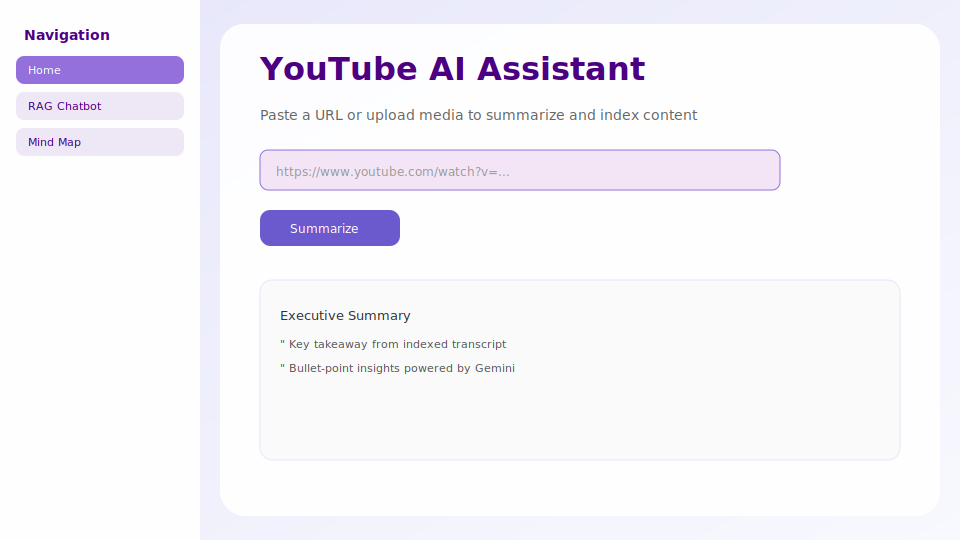
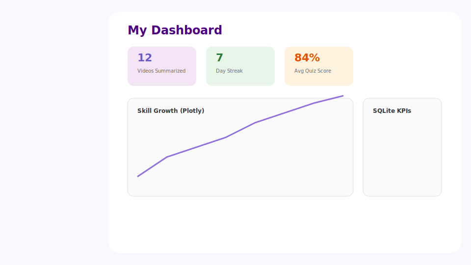
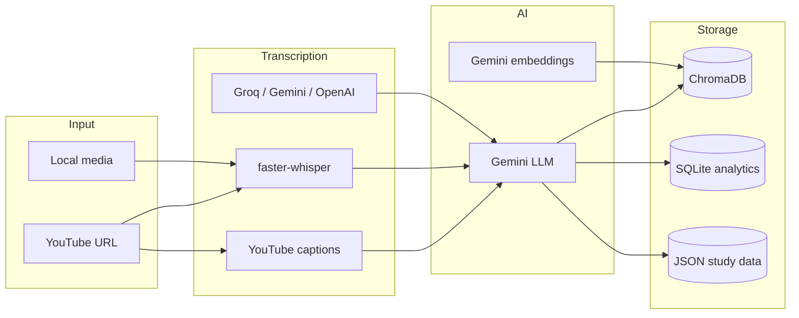

# YouTube AI Assistant — Multi-Modal Learning & Knowledge Intelligence Platform

[](https://www.python.org/)
[](https://streamlit.io/)
[](https://ai.google.dev/)
[](LICENSE)

Turn **YouTube videos** and **local audio/video files** into summaries, study materials, career insights, and an interactive **RAG** chat experience. Built with **Google Gemini**, **LangChain**, **ChromaDB**, and **Streamlit**.

**Repository:** [github.com/akshaya3790/YouTube-AI-Assistant-Multi-Modal-Learning-and-Knowledge-Intelligence-Platform](https://github.com/akshaya3790/YouTube-AI-Assistant-Multi-Modal-Learning-and-Knowledge-Intelligence-Platform)

---

## Screenshots

> UI previews below illustrate the app layout. Replace with your own PNGs anytime — see [docs/screenshots/HOW_TO_CAPTURE.md](docs/screenshots/HOW_TO_CAPTURE.md).

| Home & summarization | RAG chatbot |
|:---:|:---:|
|  |  |

| Analytics dashboard | Mind map |
|:---:|:---:|
|  |  |

---

## Features

| Module | Description |
|--------|-------------|
| **Video summarization** | Executive, detailed, bullet, and custom summary types |
| **Notes & takeaways** | Learning, exam, and revision notes; hierarchical key takeaways |
| **Timestamp summaries** | Chapter-aware summaries with timeline integration |
| **RAG chatbot** | Grounded Q&A over indexed transcripts with multiple assistant modes |
| **Mind map** | Interactive knowledge graph (force-directed or hierarchical) |
| **Flashcards & quizzes** | Study cards; MCQ, true/false, and fill-in-the-blank quizzes |
| **Resume learning** | Skill extraction, career gap analysis, portfolio building |
| **Learning roadmap** | Beginner-to-expert pathway from transcript context |
| **Multi-video center** | Synthesize insights across up to **20** YouTube URLs |
| **Media upload center** | Process local MP4, MKV, MP3, and other formats |
| **Export center** | PDF, DOCX, Markdown, JSON, and ZIP bundles |
| **Analytics dashboard** | Streaks, KPIs, quiz scores, skill growth (SQLite + Plotly) |

---

## Tech stack

| Layer | Technologies |
|-------|----------------|
| **UI** | Streamlit |
| **LLM** | Google Gemini (`google-generativeai`, `langchain-google-genai`) |
| **RAG** | ChromaDB, Gemini embeddings (`gemini-embedding-001`) |
| **Speech-to-text** | YouTube Transcript API → faster-whisper → Groq → Gemini → OpenAI Whisper |
| **Media** | yt-dlp, MoviePy |
| **Analytics** | SQLite |
| **Exports** | FPDF, python-docx |

---

## Architecture



---

## Prerequisites

- Python **3.10+** (3.11 recommended)
- [FFmpeg](https://ffmpeg.org/download.html) on your system `PATH`
- [Google AI API key](https://aistudio.google.com/apikey) (required)

Optional (transcription fallbacks):

- [Groq API key](https://console.groq.com/)
- [OpenAI API key](https://platform.openai.com/)

---

## Installation

```bash
git clone https://github.com/akshaya3790/YouTube-AI-Assistant-Multi-Modal-Learning-and-Knowledge-Intelligence-Platform.git
cd YouTube-AI-Assistant-Multi-Modal-Learning-and-Knowledge-Intelligence-Platform

python -m venv .venv

# Windows (PowerShell)
.venv\Scripts\Activate.ps1

# macOS / Linux
source .venv/bin/activate

pip install -r requirements.txt
```

---

## Configuration

Set environment variables before running:

```powershell
# Windows PowerShell — required
$env:GEMINI_API_KEY = "your_gemini_api_key"

# Optional fallbacks
$env:GROQ_API_KEY = "your_groq_key"
$env:OPENAI_API_KEY = "your_openai_key"
```

```bash
# macOS / Linux
export GEMINI_API_KEY=your_gemini_api_key
export GROQ_API_KEY=your_groq_key          # optional
export OPENAI_API_KEY=your_openai_key      # optional
```

> **Security:** Never commit API keys. Use environment variables only.

---

## Run the app

```bash
streamlit run yt_summary.py
```

Open `http://localhost:8501` in your browser.

1. Paste a **YouTube URL** on Home or use **Media Upload Center**.
2. Wait for transcription and RAG indexing.
3. Explore features from the sidebar (chat, mind map, flashcards, dashboard, exports).

---

## Project structure

```
├── yt_summary.py              # Main Streamlit application
├── rag_storage.py             # ChromaDB vector store
├── transcription_manager.py   # Multi-provider STT waterfall
├── graph_generator.py         # Knowledge graph / mind map
├── study_generator.py         # Flashcards & quizzes
├── career_generator.py        # Resume / skill gap analysis
├── multi_video_generator.py   # Cross-video synthesis
├── analytics_manager.py       # SQLite analytics
├── dashboard_view.py          # Plotly dashboard
├── document_builder.py        # PDF / DOCX / ZIP export
├── docs/screenshots/          # README UI previews
└── requirements.txt
```

---

## Data & storage

| Path | Purpose |
|------|---------|
| `chroma_db_storage/` | Vector index for RAG (runtime; do not commit) |
| `study_data/analytics.db` | Dashboard metrics |
| `study_data/` | Flashcards, profiles, exports, transcript cache |
| `temp_audio/` | Temporary yt-dlp downloads |

Delete `chroma_db_storage/` to reset the RAG index.

---

## Standalone CLI summarizer

```bash
python summary.py
```

Edit the `youtube_url` variable in `summary.py` before running.

---

## Troubleshooting

| Issue | Fix |
|-------|-----|
| **429 / quota errors** | Switch model under **AI Engine Settings** in the sidebar |
| **No transcript** | Add optional API keys; local Whisper needs CPU time |
| **yt-dlp / FFmpeg errors** | Install FFmpeg; run `pip install -U yt-dlp` |
| **ChromaDB errors** | Delete `chroma_db_storage/` and re-index videos |

---

## Author

**Akshaya** ([@akshaya3790](https://github.com/akshaya3790))

- GitHub: [akshaya3790](https://github.com/akshaya3790)
- Email: [pramathaakshaya999@gmail.com](mailto:pramathaakshaya999@gmail.com)

---

## License

MIT — see [LICENSE](LICENSE).

---

## Acknowledgments

Built with Gemini, LangChain, Streamlit, ChromaDB, and the open-source libraries in `requirements.txt`.
